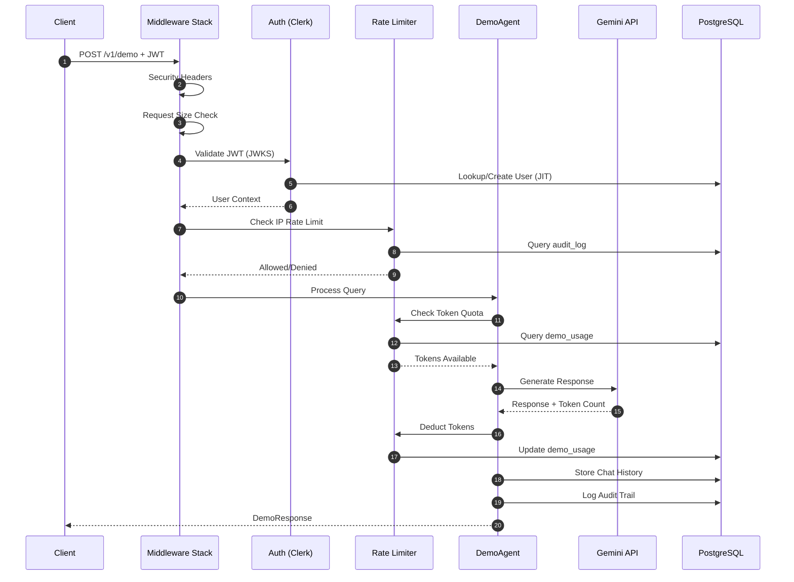
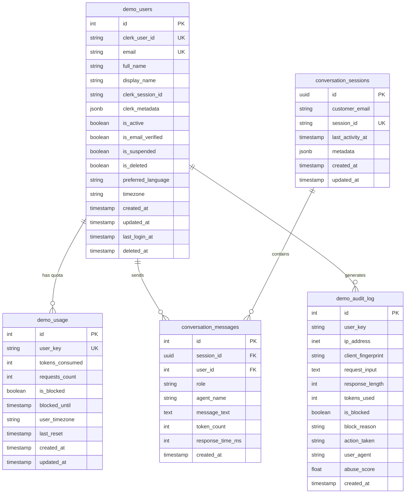

# REQ-1-1: Service Specification - Odiseo Demo Agent

> **Version:** 2.2.0
> **Last Updated:** December 2025
> **Status:** Production Ready
> **Author:** Odiseo Team

---

## Table of Contents

1. [Overview](#1-overview)
2. [Architecture](#2-architecture)
3. [API Endpoints](#3-api-endpoints)
4. [Data Models](#4-data-models)
5. [Services](#5-services)
6. [Security](#6-security)
7. [Rate Limiting](#7-rate-limiting)
8. [Middleware](#8-middleware)
9. [Configuration](#9-configuration)
10. [Database Schema](#10-database-schema)
11. [Error Handling](#11-error-handling)
12. [Logging](#12-logging)
13. [Concurrency](#13-concurrency)
14. [Testing](#14-testing)
15. [Deployment](#15-deployment)

---

## 1. Overview

### 1.1 Purpose

The **Odiseo Demo Agent** is a production-ready FastAPI microservice that provides a secure, token-limited AI chat interface powered by **Google Gemini 2.5**. It serves as a demonstration gateway for enterprise customers evaluating the Odiseo IA platform.

### 1.2 Core Responsibilities

| Responsibility | Description |
|----------------|-------------|
| **Authentication** | Validates Clerk JWT tokens using public JWKS (no secrets required) |
| **Rate Limiting** | Token-bucket algorithm with 5,000 tokens/day per user |
| **NLP Processing** | Processes queries via Gemini 2.5 with FAQ-based context |
| **User Management** | JIT (Just-In-Time) user provisioning from Clerk to PostgreSQL |
| **Audit Trail** | Complete logging of all requests for compliance |
| **Abuse Detection** | Client fingerprinting and IP reputation scoring |

### 1.3 Technology Stack

| Component | Technology | Version |
|-----------|------------|---------|
| **Framework** | FastAPI | 0.115+ |
| **Runtime** | Python | 3.10+ |
| **Database** | PostgreSQL | 13+ |
| **AI Model** | Google Gemini 2.5 Flash | Latest |
| **Auth** | Clerk (JWT/JWKS) | - |
| **Template Engine** | Jinja2 | 3.1+ |
| **Async DB** | asyncpg | 0.30+ |
| **Validation** | Pydantic | 2.11+ |
| **Logging** | structlog | 24.4+ |

---

## 2. Architecture

### 2.1 System Architecture

```
                    ┌─────────────────────────────────────┐
                    │         Load Balancer / Nginx       │
                    └──────────────┬──────────────────────┘
                                   │
         ┌─────────────────────────┼─────────────────────────┐
         │                         │                         │
    ┌────┴────┐              ┌────┴────┐              ┌────┴────┐
    │Worker 1 │              │Worker 2 │              │Worker N │
    │         │              │         │              │         │
    │ ThreadPool(10)         │ ThreadPool(10)         │ ThreadPool(10)
    │ DB Pool (5-20)         │ DB Pool (5-20)         │ DB Pool (5-20)
    └─────────┘              └─────────┘              └─────────┘
         │                         │                         │
         └─────────────────────────┼─────────────────────────┘
                                   │
                    ┌──────────────┴──────────────┐
                    │         PostgreSQL          │
                    │    (Users, Usage, Audit)    │
                    └─────────────────────────────┘
```

### 2.2 Directory Structure

```
demo-service/
├── app/
│   ├── main.py                 # FastAPI entry point
│   ├── __init__.py             # Version info
│   ├── api/
│   │   ├── demo.py             # Demo endpoints (/v1/demo)
│   │   └── health.py           # Health check endpoint
│   ├── config/
│   │   └── settings.py         # Pydantic v2 settings
│   ├── db/
│   │   └── connection.py       # AsyncPG connection pool
│   ├── middleware/
│   │   ├── request_size_limit.py
│   │   └── security_headers.py # OWASP security headers
│   ├── models/
│   │   ├── requests.py         # Request DTOs
│   │   └── responses.py        # Response DTOs
│   ├── rate_limiter/
│   │   └── token_bucket.py     # Token bucket algorithm
│   ├── security/
│   │   ├── clerk_middleware.py # JWT validation
│   │   ├── fingerprint.py      # Abuse detection
│   │   └── ip_limiter.py       # IP rate limiting
│   ├── services/
│   │   ├── clerk_service.py    # Clerk JWT validation
│   │   ├── client_ip_service.py
│   │   ├── demo_agent.py       # Core business logic
│   │   ├── gemini_client.py    # Vertex AI integration
│   │   ├── prompt_manager.py   # Jinja2 templates
│   │   └── user_service.py     # User management
│   └── utils/
│       ├── logging.py          # Structured logging
│       ├── sanitizers.py       # XSS/injection prevention
│       └── validators.py       # Input validation
├── prompts/
│   ├── demo_agent.jinja2       # Main prompt template
│   ├── config/
│   │   └── prompt_versions.yaml
│   ├── data/
│   │   ├── business_info.yaml
│   │   ├── demo_faqs.yaml      # FAQ knowledge base
│   │   └── policies.yaml
│   └── modules/
│       ├── demo_instructions.jinja2
│       ├── faq_context.jinja2
│       └── token_warning.jinja2
├── tests/
│   ├── conftest.py
│   ├── test_ip_limiter.py
│   ├── test_ip_limiter_async.py
│   ├── test_token_bucket.py
│   └── test_token_counting.py
├── credentials/                # GCP service account (gitignored)
├── docker-compose.yml
├── Dockerfile
├── Makefile
├── requirements.txt
├── .env.example
└── README.md
```

### 2.3 Request Flow



---

## 3. API Endpoints

### 3.1 Endpoints Overview

| Method | Endpoint | Auth | Description |
|--------|----------|------|-------------|
| `GET` | `/health` | No | Health check for monitoring |
| `GET` | `/` | No | Service info and available endpoints |
| `POST` | `/v1/demo` | JWT | Process demo query |
| `GET` | `/v1/demo/status` | JWT | User quota status |
| `GET` | `/v1/demo/history` | JWT | User chat history |

---

### 3.2 `GET /health`

Health check endpoint for Docker healthcheck and load balancer probes.

**Request:**
```http
GET /health HTTP/1.1
Host: localhost:9090
```

**Response (200 OK):**
```json
{
  "status": "ok",
  "service": "demo_agent",
  "version": "2.0.0"
}
```

---

### 3.3 `POST /v1/demo`

Process a demo query with token-bucket rate limiting.

**Request:**
```http
POST /v1/demo HTTP/1.1
Host: localhost:9090
Authorization: Bearer <JWT_TOKEN>
Content-Type: application/json

{
  "input": "What is Odiseo IA?",
  "language": "es",
  "session_id": "uuid-optional",
  "metadata": {
    "user_agent": "Mozilla/5.0...",
    "fingerprint": "abc123def456",
    "timezone": "America/Costa_Rica"
  }
}
```

**Request Body Schema:**

| Field | Type | Required | Constraints | Description |
|-------|------|----------|-------------|-------------|
| `input` | string | Yes | 1-2000 chars | User query |
| `language` | string | No | `es`, `en`, `ar` | Language preference (default: `es`) |
| `user_id` | integer | No | > 0 | User ID (optional, from JWT) |
| `session_id` | string | No | UUID v4 | Session tracking |
| `metadata` | object | No | - | Request metadata |
| `metadata.user_agent` | string | No | max 500 chars | HTTP User-Agent |
| `metadata.fingerprint` | string | No | max 128 chars | Client fingerprint hash |
| `metadata.timezone` | string | No | max 64 chars | IANA timezone |

**Success Response (200 OK):**
```json
{
  "success": true,
  "response": "Odiseo IA is an AI agent platform...",
  "tokens_used": 119,
  "tokens_remaining": 4881,
  "warning": {
    "is_warning": false,
    "message": null,
    "percentage_used": 2
  },
  "session_id": "9b022e74-89f3-4c5c-bb48-f1b6139b7638",
  "created_at": "2025-12-01T04:32:25.638974+00:00"
}
```

**Error Responses:**

| Status | Error Code | Description |
|--------|------------|-------------|
| 400 | `invalid_input` | Empty or invalid input |
| 401 | `authentication_required` | Missing or invalid JWT |
| 403 | `user_not_registered` | User not in database |
| 403 | `account_not_active` | Account inactive |
| 403 | `email_not_verified` | Email not verified |
| 403 | `account_suspended` | Account suspended |
| 403 | `account_deleted` | Account deleted |
| 403 | `suspicious_behavior_detected` | Abuse score exceeded |
| 429 | `demo_quota_exceeded` | Token quota exhausted |
| 500 | Internal error | Server error |

---

### 3.4 `GET /v1/demo/status`

Get authenticated user's current quota status.

**Request:**
```http
GET /v1/demo/status HTTP/1.1
Host: localhost:9090
Authorization: Bearer <JWT_TOKEN>
```

**Response (200 OK):**
```json
{
  "tokens_used": 201,
  "tokens_remaining": 4799,
  "daily_limit": 5000,
  "percentage_used": 4,
  "requests_count": 2,
  "is_blocked": false,
  "blocked_until": null,
  "user_timezone": "America/Costa_Rica",
  "last_reset": "2025-11-30T18:39:59.738622+00:00",
  "next_reset": "2025-12-01T06:00:00+00:00",
  "warning": {
    "is_warning": false,
    "message": null,
    "percentage_used": 4
  }
}
```

---

### 3.5 `GET /v1/demo/history`

Retrieve user's conversation history.

**Request:**
```http
GET /v1/demo/history?limit=10 HTTP/1.1
Host: localhost:9090
Authorization: Bearer <JWT_TOKEN>
```

**Query Parameters:**

| Parameter | Type | Default | Constraints | Description |
|-----------|------|---------|-------------|-------------|
| `limit` | integer | 100 | 1-500 | Max messages to return |
| `user_id` | integer | - | > 0 | User ID (for OTP users) |

**Response (200 OK):**
```json
{
  "success": true,
  "messages": [
    {
      "id": 1,
      "role": "user",
      "message_text": "Hola",
      "token_count": 0,
      "created_at": "2025-11-30T19:44:18.507122+00:00"
    },
    {
      "id": 2,
      "role": "model",
      "message_text": "Hello! I'm your Odiseo IA assistant...",
      "token_count": 23,
      "created_at": "2025-11-30T19:44:18.510000+00:00"
    }
  ],
  "total_messages": 2
}
```

---

## 4. Data Models

### 4.1 Request Models

#### DemoRequest

```python
class DemoRequest(BaseModel):
    user_id: int | None = Field(None, gt=0)
    session_id: str | None = None
    input: str = Field(..., min_length=1, max_length=2000)
    language: str = Field(default="es", pattern="^(es|en|ar)$")
    metadata: Metadata | None = None
```

#### Metadata

```python
class Metadata(BaseModel):
    user_agent: str | None = Field(None, max_length=500)
    fingerprint: str | None = Field(None, max_length=128)
    timezone: str | None = Field(None, max_length=64)
```

### 4.2 Response Models

#### DemoResponse

```python
class DemoResponse(BaseModel):
    success: bool = True
    response: str
    tokens_used: int = Field(ge=0)
    tokens_remaining: int = Field(ge=0)
    warning: TokenWarning
    session_id: str
    created_at: str  # ISO 8601
```

#### TokenWarning

```python
class TokenWarning(BaseModel):
    is_warning: bool = False
    message: str | None = None
    percentage_used: int = Field(ge=0, le=100)
```

#### ErrorResponse

```python
class ErrorResponse(BaseModel):
    success: bool = False
    error: str           # snake_case identifier
    message: str         # Human-readable message
    hint: str | None     # Resolution suggestion
    retry_after_seconds: int | None  # Retry time
```

---

## 5. Services

### 5.1 DemoAgent

**Location:** `app/services/demo_agent.py`

Core business logic orchestrator that coordinates:
- IP rate limiting
- Fingerprint analysis
- Token quota management
- Gemini API calls
- Audit logging

**Key Method: `process_query()`**

```python
async def process_query(
    self,
    user_input: str,
    user_key: str,
    language: str = "es",
    ip_address: str | None = None,
    user_agent: str | None = None,
    client_fingerprint: str | None = None,
    user_timezone: str | None = None,
) -> tuple[str | None, int, TokenWarning, str | None]:
```

**Processing Steps:**
1. Check IP rate limiting
2. Analyze fingerprint and compute abuse score
3. Check token quota before processing
4. Load system prompt with FAQ context
5. Call Gemini API
6. Deduct tokens from user's quota
7. Check warning threshold
8. Log audit trail
9. Return response

### 5.2 GeminiClient

**Location:** `app/services/gemini_client.py`

Wrapper for Google Gemini API via Google Gen AI SDK.

**Features:**
- Non-blocking API calls via `asyncio.run_in_executor()`
- Shared ThreadPoolExecutor for concurrency
- Accurate token counting
- Automatic retry handling

**Authentication Methods:**
1. Service Account JSON (GOOGLE_APPLICATION_CREDENTIALS) - Recommended
2. Application Default Credentials (ADC) - Fallback

**Key Methods:**
```python
async def generate_response(
    self,
    system_prompt: str,
    user_message: str,
    temperature: float | None = None,
    max_output_tokens: int | None = None,
) -> tuple[str, int]:  # (response_text, tokens_used)

async def count_tokens(
    self,
    system_prompt: str,
    user_message: str,
) -> int:

@classmethod
def shutdown_executor(cls) -> None:
    # CRITICAL: Must be called during app shutdown
```

### 5.3 ClerkService

**Location:** `app/services/clerk_service.py`

Validates Clerk JWT tokens using public JWKS (no secret keys required).

**Features:**
- JWT validation via RS256 public keys
- JWKS endpoint caching
- User synchronization to PostgreSQL
- JIT (Just-In-Time) provisioning

**Key Methods:**
```python
async def verify_token(self, token: str) -> tuple[dict | None, str | None]
async def sync_user_from_clerk(...) -> tuple[int | None, bool, str | None]
async def get_user_by_clerk_id(clerk_user_id: str, fallback_email: str | None) -> dict | None
async def update_session(clerk_user_id: str, clerk_session_id: str) -> bool
async def soft_delete_user(clerk_user_id: str) -> bool
```

### 5.4 PromptManager

**Location:** `app/services/prompt_manager.py`

Manages Jinja2 prompt templates and FAQ data.

**Features:**
- Template loading from `prompts/` directory
- FAQ data loading from YAML
- Dynamic context rendering
- Autoescape enabled for XSS prevention

**Template Structure:**
```
prompts/
├── demo_agent.jinja2           # Main template
├── modules/
│   ├── demo_instructions.jinja2  # Behavioral rules
│   ├── faq_context.jinja2        # FAQ knowledge base
│   └── token_warning.jinja2      # Quota warnings
└── data/
    └── demo_faqs.yaml            # FAQ data (40+ questions)
```

---

## 6. Security

### 6.1 Authentication (Clerk)

**Flow:**
```
Frontend (Clerk SDK) → JWT → Backend → JWKS validation → PostgreSQL sync
```

**JWT Validation:**
- Algorithm: RS256
- Public keys fetched from: `https://{CLERK_FRONTEND_API}/.well-known/jwks.json`
- Validates: signature, expiration, not-before, issuer
- Optional audience validation (CWE-347 prevention)

**Required Claims:**
- `sub`: Clerk user ID
- `exp`: Expiration timestamp
- `iat`: Issued-at timestamp
- `nbf`: Not-before timestamp

### 6.2 Input Sanitization

**Functions in `app/utils/sanitizers.py`:**

| Function | Purpose | CWE Mitigated |
|----------|---------|---------------|
| `sanitize_html()` | XSS prevention | CWE-79 |
| `sanitize_user_input()` | Null bytes, control chars | CWE-20 |
| `sanitize_error_message()` | Info disclosure prevention | CWE-209 |

**Validation in Request Models:**
- User-Agent: Control character removal
- Fingerprint: Alphanumeric only
- Timezone: IANA format validation
- Session ID: UUID v4 validation

### 6.3 Security Headers

**Middleware:** `app/middleware/security_headers.py`

| Header | Value | Purpose |
|--------|-------|---------|
| X-Content-Type-Options | `nosniff` | MIME sniffing prevention |
| X-Frame-Options | `DENY` | Clickjacking prevention |
| X-XSS-Protection | `1; mode=block` | XSS filter |
| Strict-Transport-Security | `max-age=31536000; includeSubDomains; preload` | HTTPS enforcement |
| Content-Security-Policy | Strict policy | XSS/injection prevention |
| Referrer-Policy | `strict-origin-when-cross-origin` | Referrer control |
| Permissions-Policy | Restricted features | Feature control |

### 6.4 CORS Configuration

```python
CORSMiddleware(
    allow_origins=cors_origins,      # From CORS_ALLOW_ORIGINS
    allow_credentials=True,          # Required for JWT
    allow_methods=["GET", "POST", "OPTIONS"],
    allow_headers=["Authorization", "Content-Type", "X-Request-ID"],
)
```

### 6.5 Abuse Detection

**FingerprintAnalyzer** (`app/security/fingerprint.py`):

Computes abuse score (0.0-1.0) based on:
- User-Agent analysis (automation keywords)
- Request rate patterns
- IP reputation score
- IP rotation patterns
- Token consumption rate
- Fingerprint consistency

**Suspicious UA Keywords:**
- `headless`, `phantom`, `selenium`, `puppeteer`, `playwright`
- `webdriver`, `bot`, `crawler`, `spider`, `scraper`

**Blocking Threshold:**
- Default: `ABUSE_SCORE_BLOCK_THRESHOLD=0.9`
- Configurable: 0.5 to 1.0

---

## 7. Rate Limiting

### 7.1 Token Bucket Algorithm

**Location:** `app/rate_limiter/token_bucket.py`

**Configuration:**

| Variable | Default | Description |
|----------|---------|-------------|
| `DEMO_MAX_TOKENS` | 5000 | Daily token limit per user |
| `DEMO_COOLDOWN_HOURS` | 24 | Block duration after quota exceeded |
| `DEMO_WARNING_THRESHOLD` | 85 | Warning percentage threshold |
| `DEMO_TOKENS_PER_REQUEST` | 100 | Estimated tokens for pre-check |

**States:**

| State | % Used | `is_blocked` | `warning.is_warning` |
|-------|--------|--------------|---------------------|
| Normal | 0-84% | `false` | `false` |
| Warning | 85-99% | `false` | `true` |
| Blocked | 100%+ | `true` | `true` |

**Reset Logic:**
- Resets at midnight in user's timezone
- Timezone stored per user in `demo_usage.user_timezone`
- Falls back to UTC if timezone conversion fails

**Key Methods:**
```python
async def check_quota(user_key, tokens_needed, user_timezone) -> (bool, int)
async def deduct_tokens(user_key, tokens_used) -> int
async def get_quota_status(user_key) -> dict
async def refund_tokens(user_key, tokens_to_refund) -> int
async def unblock_user(user_key) -> bool
```

### 7.2 IP Rate Limiting

**Location:** `app/security/ip_limiter.py`

**Configuration:**

| Variable | Default | Description |
|----------|---------|-------------|
| `IP_RATE_LIMIT_REQUESTS` | 100 | Max requests per IP per minute |
| `IP_RATE_LIMIT_WINDOW_SEC` | 60 | Time window in seconds |
| `IP_SUSPICIOUS_REQ_PER_MIN` | 5 | Threshold for suspicious flag |
| `IP_SUSPICIOUS_UNIQUE_USERS` | 10 | Unique users threshold |

**Behavior:**
- Fail-closed: Denies request on database errors
- Empty IP address: Returns `(False, 0)` - request denied

---

## 8. Middleware

### 8.1 Middleware Stack (Order Matters)

1. **ClerkAuthMiddleware** - JWT validation
2. **RequestSizeLimitMiddleware** - Request size limits
3. **CORSMiddleware** - Cross-origin settings
4. **SecurityHeadersMiddleware** - Security headers
5. **Correlation ID Middleware** - Request tracing

### 8.2 ClerkAuthMiddleware

**Public Routes (No Auth Required):**
- `/health`
- `/metrics`
- `/docs`, `/redoc`, `/openapi.json`
- `/v1/contact`, `/v1/booking`
- `OPTIONS` requests (CORS preflight)
- Routes starting with `/_`

**Request State After Auth:**
```python
request.state.user = {
    "clerk_user_id": "user_2abc...",
    "email": "user@example.com",
    "email_verified": True,
    "db_user_id": 123,
    "full_name": "John Doe",
    "is_active": True,
    "clerk_metadata": {},
    "preferred_language": "es",
    "is_authenticated": True,
}
request.state.is_authenticated = True
```

### 8.3 RequestSizeLimitMiddleware

**Configuration:**
```python
RequestSizeLimitMiddleware(
    max_size=50 * 1024,              # 50KB default
    endpoint_limits={
        "/v1/demo": 10 * 1024,       # 10KB for demo endpoint
    },
)
```

---

## 9. Configuration

### 9.1 Environment Variables

All configuration is managed via environment variables in `.env` file.

#### Database

| Variable | Required | Default | Description |
|----------|----------|---------|-------------|
| `DATABASE_URL` | Yes | - | PostgreSQL connection string |
| `SCHEMA_NAME` | No | `test` | PostgreSQL schema name |

#### Google Cloud / Vertex AI

| Variable | Required | Default | Description |
|----------|----------|---------|-------------|
| `GCP_PROJECT_ID` | Yes | - | Google Cloud project ID |
| `GCP_LOCATION` | No | `us-central1` | Vertex AI region |
| `GOOGLE_APPLICATION_CREDENTIALS` | Yes* | - | Path to service account JSON |
| `MODEL` | No | `gemini-2.5-flash` | Gemini model ID |
| `TEMPERATURE` | No | `0.2` | Model temperature (0.0-2.0) |
| `MAX_OUTPUT_TOKENS` | No | `2048` | Max response tokens |

#### Demo Limits

| Variable | Required | Default | Description |
|----------|----------|---------|-------------|
| `DEMO_MAX_TOKENS` | No | `5000` | Daily token limit per user |
| `DEMO_COOLDOWN_HOURS` | No | `24` | Block duration (1-168) |
| `DEMO_WARNING_THRESHOLD` | No | `85` | Warning percentage (1-100) |
| `DEMO_TOKENS_PER_REQUEST` | No | `100` | Estimated tokens per request |
| `ABUSE_SCORE_BLOCK_THRESHOLD` | No | `0.9` | Block threshold (0.5-1.0) |

#### Server

| Variable | Required | Default | Description |
|----------|----------|---------|-------------|
| `DEMO_AGENT_HOST` | No | `0.0.0.0` | Bind address |
| `DEMO_AGENT_PORT` | No | `8082` | Listen port |

#### Security

| Variable | Required | Default | Description |
|----------|----------|---------|-------------|
| `ENABLE_FINGERPRINT` | No | `true` | Enable fingerprinting |
| `FINGERPRINT_SCORE_THRESHOLD` | No | `0.7` | Warning threshold |

#### Clerk Authentication

| Variable | Required | Default | Description |
|----------|----------|---------|-------------|
| `CLERK_FRONTEND_API` | Yes* | `clerk.accounts.dev` | Clerk instance domain |
| `CLERK_PUBLISHABLE_KEY` | No | - | For audience validation |
| `ENABLE_CLERK_AUTH` | No | `true` | Enable/disable auth |

#### CORS

| Variable | Required | Default | Description |
|----------|----------|---------|-------------|
| `CORS_ALLOW_ORIGINS` | No | `http://localhost:8080,http://localhost:3000` | Allowed origins |
| `CORS_ALLOW_CREDENTIALS` | No | `true` | Allow credentials |

#### Rate Limiting

| Variable | Required | Default | Description |
|----------|----------|---------|-------------|
| `IP_RATE_LIMIT_REQUESTS` | No | `100` | Max requests per IP/min |
| `IP_RATE_LIMIT_WINDOW_SEC` | No | `60` | Time window |
| `IP_SUSPICIOUS_REQ_PER_MIN` | No | `5` | Suspicious threshold |
| `IP_SUSPICIOUS_UNIQUE_USERS` | No | `10` | Unique users threshold |

#### Concurrency

| Variable | Required | Default | Description |
|----------|----------|---------|-------------|
| `UVICORN_WORKERS` | No | `4` | Worker processes (1-32) |
| `MAX_CONCURRENT_REQUESTS` | No | `10` | Concurrent Gemini calls per worker |

#### Database Pool

| Variable | Required | Default | Description |
|----------|----------|---------|-------------|
| `DB_POOL_MIN_SIZE` | No | `5` | Min connections per worker |
| `DB_POOL_MAX_SIZE` | No | `20` | Max connections per worker |
| `DB_COMMAND_TIMEOUT` | No | `60` | Query timeout (seconds) |
| `DB_POOL_MAX_INACTIVE_LIFETIME` | No | `300` | Idle connection timeout |

#### Logging

| Variable | Required | Default | Description |
|----------|----------|---------|-------------|
| `LOG_LEVEL` | No | `INFO` | Log level |
| `LOG_TO_FILE` | No | `true` | Enable file logging |
| `LOG_DIR` | No | `logs` | Log directory |
| `LOG_CONSOLE_ENABLED` | No | `true` | Console output |
| `LOG_JSON_FORMAT` | No | `true` | JSON format for files |
| `LOG_FILE_MAX_MB` | No | `10` | Max file size before rotation |
| `LOG_FILE_BACKUP_COUNT` | No | `5` | Rotated files to keep |

---

## 10. Database Schema

### 10.1 Tables Overview

| Table | Description |
|-------|-------------|
| `demo_users` | User accounts (synced from Clerk) |
| `demo_usage` | Token quota tracking |
| `demo_audit_log` | Request audit trail |
| `conversation_sessions` | Chat sessions |
| `conversation_messages` | Chat messages |

### 10.2 Schema Diagram



### 10.3 Key Database Functions

| Function | Purpose |
|----------|---------|
| `upsert_clerk_user()` | JIT user provisioning |
| `update_clerk_session()` | Update session ID |
| `soft_delete_clerk_user()` | Soft delete (idempotent) |

---

## 11. Error Handling

### 11.1 Error Response Format

All API errors use consistent `ErrorResponse` format:

```json
{
  "success": false,
  "error": "error_code",
  "message": "Human-readable message",
  "hint": "Optional resolution hint",
  "retry_after_seconds": 300
}
```

### 11.2 HTTP Status Codes

| Code | Usage |
|------|-------|
| 200 | Success |
| 400 | Invalid input |
| 401 | Authentication required/failed |
| 403 | Forbidden (inactive, suspended, blocked) |
| 429 | Rate limit exceeded |
| 500 | Internal server error |

### 11.3 Error Codes

| Code | Description |
|------|-------------|
| `authentication_required` | No JWT provided |
| `invalid_input` | Invalid request data |
| `user_not_found` | User not in database |
| `user_not_registered` | User auth'd but not fully registered |
| `account_not_active` | Account inactive |
| `email_not_verified` | Email not verified |
| `account_suspended` | Account suspended |
| `account_deleted` | Account deleted |
| `demo_quota_exceeded` | Token quota exhausted |
| `suspicious_behavior_detected` | Abuse score exceeded |

---

## 12. Logging

### 12.1 Configuration

Uses **structlog** for structured JSON logging.

**Features:**
- Console output with colors (development)
- JSON file logging with rotation (production)
- Sensitive data sanitization (CWE-532 mitigation)
- Startup banner with config summary

### 12.2 Log Levels

| Level | Usage |
|-------|-------|
| DEBUG | Detailed debugging info |
| INFO | Normal operation events |
| WARNING | Potential issues |
| ERROR | Error conditions |
| CRITICAL | System failures |

### 12.3 Usage

```python
from app.utils.logging import get_logger

logger = get_logger(__name__)
logger.info("Processing query", user_id=123, action="demo")
```

### 12.4 Sensitive Data Redaction

Automatically redacts:
- JWT tokens
- API keys
- Email addresses
- IP addresses (partially)
- Passwords

---

## 13. Concurrency

### 13.1 Architecture

The service supports high concurrency through:

1. **Uvicorn Workers** - Multiple processes for parallel request handling
2. **ThreadPoolExecutor** - Non-blocking Gemini API calls within each worker
3. **AsyncPG Connection Pool** - Async database operations

### 13.2 Capacity Calculation

```
Total Concurrent Gemini Calls = UVICORN_WORKERS × MAX_CONCURRENT_REQUESTS
Total DB Connections = UVICORN_WORKERS × DB_POOL_MAX_SIZE
```

### 13.3 Recommended Settings

| Deployment | Workers | Concurrent/Worker | Total Capacity |
|------------|---------|-------------------|----------------|
| Development | 1 | 5 | 5 |
| Small | 2 | 10 | 20 |
| Medium | 4 | 10 | 40 |
| Large | 8 | 15 | 120 |

### 13.4 ThreadPoolExecutor Lifecycle

**CRITICAL:** Must call `GeminiClient.shutdown_executor()` during app shutdown:

```python
@asynccontextmanager
async def lifespan(app: FastAPI):
    # Startup
    await init_db()
    yield
    # Shutdown
    GeminiClient.shutdown_executor()
    await close_db()
```

---

## 14. Testing

### 14.1 Test Structure

```
tests/
├── conftest.py              # Pytest fixtures
├── test_ip_limiter.py       # IP rate limiting tests
├── test_ip_limiter_async.py # Async IP limiter tests
├── test_token_bucket.py     # Token bucket tests
├── test_token_counting.py   # Token counting tests
└── README_TESTS.md          # Test documentation
```

### 14.2 Running Tests

```bash
# Run all tests
pytest tests/ -v

# Run specific category
pytest tests/test_token_bucket.py -v

# With coverage
pytest tests/ --cov=app --cov-report=html
```

### 14.3 Test Categories

| Category | Purpose |
|----------|---------|
| IP Limiter | Rate limiting, sliding window, block/unblock |
| Token Bucket | Consumption, daily limits, warnings, auto-reset |
| Token Counting | Gemini response counting, usage accuracy |

---

## 15. Deployment

### 15.1 Docker

```bash
# Build and run
docker-compose up -d --build

# View logs
docker logs -f demo-agent

# Stop
docker-compose down
```

### 15.2 Local Development

```bash
# Create virtual environment
python -m venv venv
source venv/bin/activate

# Install dependencies
pip install -r requirements.txt

# Configure environment
cp .env.example .env
# Edit .env with your credentials

# Run
uvicorn app.main:app --reload --port 9090
```

### 15.3 Code Quality

```bash
# Format
black app/

# Lint
ruff check app/

# Type checking
mypy app/ --ignore-missing-imports

# Full check
ruff check app/ && black --check app/ && isort --check app/
```

### 15.4 Health Check

```bash
curl http://localhost:9090/health
# Expected: {"status":"ok","service":"demo_agent","version":"2.0.0"}
```

---

## Appendix A: CWE Mitigations

| CWE | Description | Mitigation |
|-----|-------------|------------|
| CWE-20 | Improper Input Validation | Request validators, sanitizers |
| CWE-79 | Cross-site Scripting (XSS) | `sanitize_html()`, Jinja2 autoescape |
| CWE-89 | SQL Injection | Parameterized queries, asyncpg |
| CWE-209 | Error Message Info Disclosure | `sanitize_error_message()` |
| CWE-346 | Origin Validation Error | CORS validation, credential restrictions |
| CWE-347 | Improper Verification of Signature | JWT audience validation |
| CWE-362 | Race Condition | Atomic PostgreSQL UPDATE |
| CWE-400 | Uncontrolled Resource Consumption | Rate limiters fail-closed |
| CWE-532 | Information Exposure Through Log Files | Log sanitization |
| CWE-1021 | Improper Restriction of Rendered UI Layers | Security headers |

---

## Appendix B: Compliance Checklist

| Requirement | Status |
|-------------|--------|
| Clean code, PEP-8 | ✅ ruff + black enforced |
| No deprecated libraries | ✅ google-genai SDK |
| Latest stable versions | ✅ Pydantic 2.11+, FastAPI 0.115+ |
| Type hints 100% | ✅ All functions typed |
| mypy OK | ✅ Strict mode enabled |
| Dead code removed | ✅ No unused code |
| No anti-patterns | ✅ Pydantic v2 ConfigDict pattern |
| Prompt templates | ✅ Jinja2 in `/prompts/` |
| Clerk auth enforced | ✅ JWT/JWKS validation |
| Token tracking | ✅ Token bucket algorithm |
| Documentation | ✅ Complete |

---

*Document generated from source code analysis - December 2025*