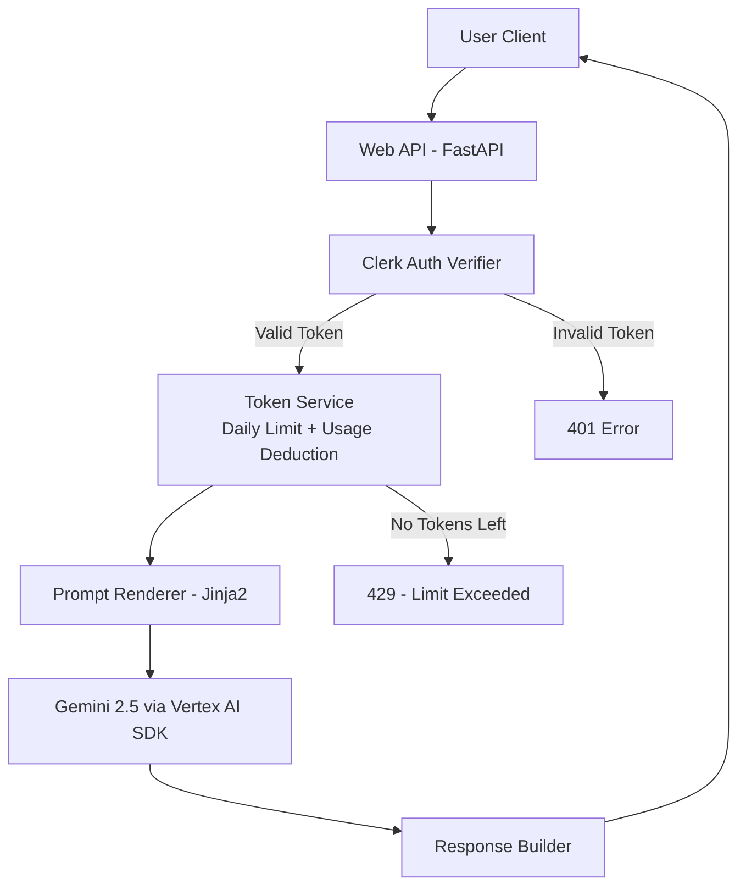

# REQ-1: Web API Gateway for Gemini 2.5 with Clerk Auth & Token Usage

## 1. Overview
This document defines the software architecture and functional requirements for a minimal, clean, and production‑ready API service. The service exposes a single HTTP API endpoint that receives user requests, validates authentication using Clerk tokens, and forwards prompts to **Gemini 2.5** using the latest Google Cloud Vertex AI SDK. All responses follow the behavior dictated by prompt templates located in `@prompts/`.

The system must maintain the existing logic for:
- **Daily token allocation per user**
- **Token deduction per request**
- **Usage tracking & persistence**

Dead code, anti‑patterns, legacy clients, and deprecated dependencies must be removed entirely.

---

## 2. Functional Requirements

### 2.1 API Exposure
- The service exposes a **single web API** to receive a request from a logged‑in user.
- The API must be **FastAPI‑based**, simple, maintainable, and modular.

### 2.2 Authentication (Clerk.com)
- The user **must be logged in**.
- Every request must include a **valid Clerk JWT**.
- If the token is missing or invalid → return **401 Unauthorized**.

### 2.3 Token Usage Logic
- Read the user’s daily token limit.
- Deduct tokens per request.
- Persist usage.
- Block the request if the user runs out of tokens.

### 2.4 Prompt Execution (Gemini 2.5)
- Use the **latest Google Cloud Vertex AI SDK**.
- Never use legacy clients.
- Read prompt definitions from `/prompts/...`.
- Use Jinja2 for template processing.

---

## 3. Non‑Functional Requirements

### 3.1 Code Quality
- Clean, simple, no over‑engineering (KISS).
- DRY: no duplicated logic.
- SOLID principles applied.
- Fully typed using Python 3.10+ type hints.
- No unused imports, variables, or f‑strings.
- No circular imports.
- No hardcoded values — use `config/settings.py`.

### 3.2 Compliance & Tooling
- Code must pass:
  - **black** (format)
  - **isort** (imports)
  - **ruff** (lint)
  - **mypy** (type-check)
- Dead code and anti‑patterns removed.
- All new functionality must include documentation in `README.md`.

### 3.3 Testing
- End‑to‑end tests using **pytest**.
- Every component must be fully validated before merging.

---

## 4. Dependency Requirements

### 4.1 Required Libraries (Latest Stable)
```
# Core
fastapi>=0.115.0
uvicorn[standard]>=0.32.0
pydantic>=2.11.0
pydantic-settings>=2.11.0
python-dotenv>=1.0.0
jinja2>=3.1.0

# Database
asyncpg>=0.30.0

# Google Gen AI SDK (replaces deprecated google-cloud-aiplatform)
google-genai>=1.0.0

# Logging
structlog>=24.4.0

# Security
PyJWT[crypto]>=2.9.0

# Development
pytest>=8.3.0
pytest-asyncio>=0.24.0
mypy>=1.13.0
ruff>=0.8.0
black>=24.0.0
isort>=5.13.0
```

### 4.2 Removed (Deprecated or Legacy)
- `google-cloud-aiplatform` - replaced by `google-genai` (new SDK)
- `vertexai.generative_models` - deprecated June 2025, removed June 2026
- `requests` - not used (internal HTTP calls use SDK clients)
- `httpx` - not used (no external HTTP calls needed)
- `sqlalchemy` - using `asyncpg` directly
- `psycopg2-binary` - replaced by `asyncpg`
- `bcrypt` - not used (Clerk handles auth)
- `svix` - not used (no webhook signature verification)
- `apscheduler` - not used
- `mcp` - not used
- `email-validator` - not used (no EmailStr validation)
- `python-json-logger` - not used (structlog handles logging)
- `captcha_handler.py` - reCAPTCHA functionality removed
- `test_captcha_handler.py` - dead test file removed
- `DemoCaptchaResponse` - unused Pydantic model removed

---

## 5. Architecture



---

## 6. .env.example Validation
Every key referenced in `config/settings.py` must exist in `.env.example`. Missing keys must be added.

---

## 7. README.md Requirements
Generate using:  
https://www.makeareadme.com/

Include:
- Setup instructions  
- Environment configuration  
- Dependency list  
- Mermaid diagrams  
- API usage examples  
- Testing instructions  

---

## 8. Compliance Checklist

| Requirement | Status | Notes |
|------------|--------|-------|
| Clean code, PEP‑8 | ✅ | ruff + black enforced |
| No deprecated libraries | ✅ | google-cloud-aiplatform 1.74+ |
| Latest stable versions | ✅ | Pydantic 2.11+, FastAPI 0.115+ |
| Type hints 100% | ✅ | All functions typed |
| mypy OK | ✅ | Strict mode enabled |
| ruff OK | ✅ | All checks passed |
| black OK | ✅ | Line length 100 |
| isort OK | ✅ | Profile black |
| Dead code removed | ✅ | exceptions.py, unused validators removed |
| No anti‑patterns | ✅ | Pydantic v2 ConfigDict pattern |
| Prompt templates in `/prompts/` | ✅ | Jinja2 templates |
| Clerk auth enforced | ✅ | JWT validation middleware |
| Tokens deducted correctly | ✅ | Token bucket algorithm |
| README updated | ✅ | Full documentation |
| `.env.example` validated | ✅ | All keys documented |
| Context memory updated | ✅ | .claude.md created |

---

## 9. Final Notes
- **No new components unless strictly necessary**.
- **Always test end‑to‑end before finalizing**.
- **Never hardcode values**.
- **Use official Vertex AI recommended SDK only**.

